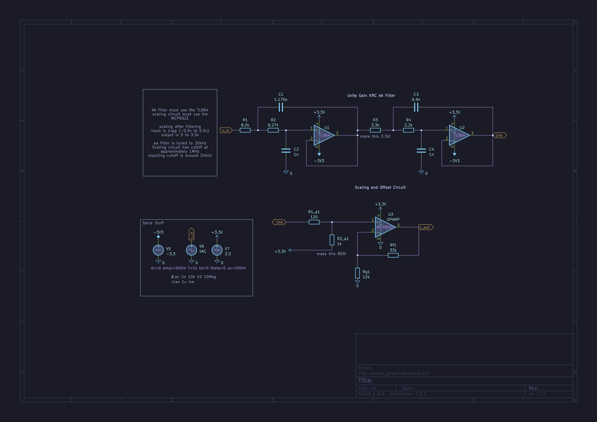

# tokyo-night-kicad-theme

A clean Kicad schematic editor (eeschema) theme that celebrates the lights of Downtown Tokyo at night.

copy the ``.json`` to ``~/.var/app/org.kicad.KiCad/config/kicad/7.0/colors`` for the flatpak or ``~/.config/kicad/7.0/colors``
otherwise just go to ``preferences>preferences>schematic editor>colors`` and click ``open theme folder`` then copy the theme there.

[original colorscheme by @enkia](https://github.com/enkia/tokyo-night-vscode-theme)

